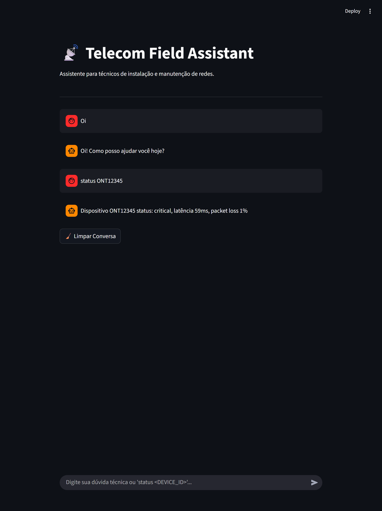
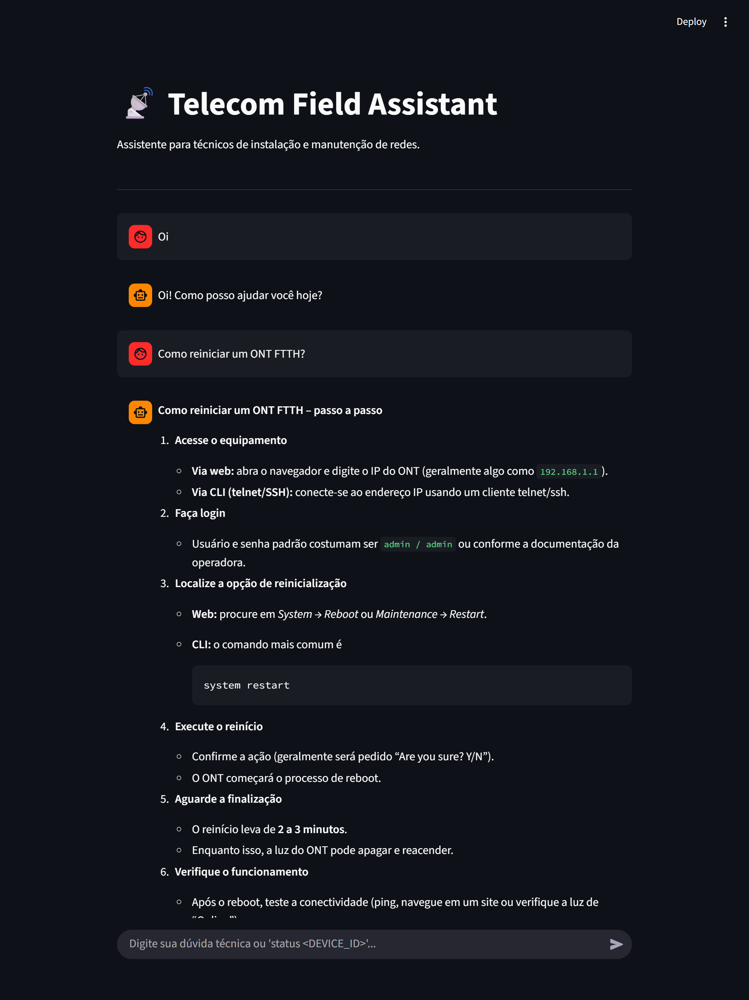

# 📡 Telecom Field Assistant

Assistente técnico para redes FTTH, integrado com base de conhecimento (KB), LLM (Ollama) e monitoramento de roteadores/ONTs.
Fornece respostas passo a passo, claras e curtas, e permite consultas em tempo real a dispositivos.

---

## 🔹 Funcionalidades

1. **Consultas técnicas com contexto (RAG)**

    * Busca na base de conhecimento relevante antes de gerar a resposta.
    * Mantém histórico de conversa para contexto contínuo.
2. **Monitoramento de dispositivos**

    * Comando `status <DEVICE_ID>` para obter status, latência e perda de pacotes.
3. **Histórico de chat**

    * Memória limitada às últimas 20 interações.
4. **Interface CLI e Web (Streamlit)**

    * CLI para técnicos em campo.
    * Web para visualização de contexto e respostas detalhadas.

---

## 🔹 Pré-requisitos

* Python 3.10+
* `.env` com variável:

  ```bash
  OLLAMA_API_KEY=your_api_key_here
  ```
* Dependências:

  ```bash
  pip install chromadb ollama streamlit python-dotenv
  ```

---

## 🔹 Estrutura do Projeto

```
agent/
├─ agent.py           # Lógica principal do agente
├─ memory.py          # Histórico de chat
├─ tools/
│  └─ router_api.py   # Simula status de dispositivos
rag/
├─ kb_data.py         # Base de conhecimento FTTH
├─ vector_store.py    # Armazena e busca documentos via ChromaDB
run.py                # CLI
api/
└─ main.py            # Streamlit app
```

---

## 🔹 Exemplos de Interação

### CLI

```bash
$ python run.py
📡 Telecom Field Assistant CLI

Digite sua dúvida técnica ou 'status <DEVICE_ID>'

User > Como reduzir packet loss?
Agent >

User > status ONT12345
Dispositivo ONT12345 status: ok, latência 45ms, packet loss 3%
```

### Streamlit

* Abra o app:

```bash
streamlit run api/main.py
```

* Interação:

1. Digite sua dúvida técnica:

   ```
   Como reiniciar um ONT FTTH?
   ```

2. Comando de status:

   ```
   status ONT12345
   ```

* O histórico do chat exibe:

    * Pergunta do usuário
    * Resposta do agente

* Limpar conversa: clique no botão **🧹 Limpar Conversa**.






---

## 🔹 Como funciona internamente

1. **RAG + LLM**

    * Busca na KB (via ChromaDB) os documentos mais relevantes.
    * Envia contexto + histórico de chat para LLM gerar resposta.
2. **Memória**

    * Armazena até 20 mensagens (usuário + agente).
3. **Router API**

    * Simula status dinâmico (`ok`, `degraded`, `critical`) com latência e packet loss.
4. **Cache simples**

    * Respostas anteriores são guardadas para agilizar consultas repetidas.

---
